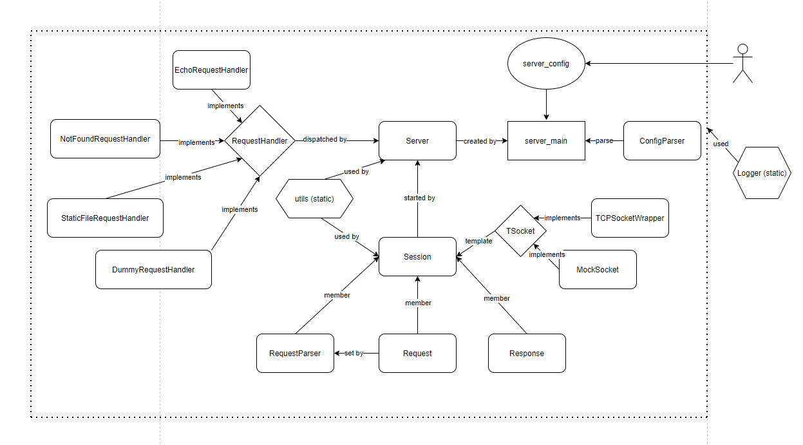

# CS 130 Webserver - Team Aite

## Overview
We built a simple, configurable web server that can echo HTTP requests, serve static files, or show a 404 error page when needed. It is easily extendible to different types of requests with steps listed below for adding your own custom request handlers.

## Layout of source code
  

## Build
To build the code create a build directory in the root directory. In the build directory run `cmake` to generate a `Makefile` and perform an out-of-source build
```
$ mkdir build
$ cd build
$ cmake ..
$ make
```  

## Test
To run all tests (in the build directory)
```
$ make test
```
To run specific tests starting from the build directory execute the following command to run the `session_lib_test` 
```
$ ./bin/session_lib_test
```
similar process is taken for running other individual tests, except config_parse_lib_test and request_parser_lib_test which require commands of the following:
```
$ cd ../tests/config_parser && ../../build/bin/config_parser_lib_test && cd ../../build
```
which have to be run from the directory in which the files they reference live.  

## Build and Run Coverage Tests
From the root directory create a new sub-directory for coverage:
```
mkdir build_coverage
cd build_coverage
cmake -DCMAKE_BUILD_TYPE=Coverage ..
make coverage
```
This will create an HTML report in ${REPO}/build_coverage/report/index.html that you can view in your browser with detailed information on line and branch coverage.  
**

## Run  
To launch the server (from the build directory) run the following command
```
$ ./bin/server ../server_config
```  

## Config File
The config file allows for configurable port numbers, and handler serving paths. The handlers are configured in location-major handler-typed format.

Relative paths for static file handlers are also supported and are relative with respected to the current working directory of the server.

The config file uses "#" for comments.

Strings can be optionally quoted with the " character to support strings with spaces
```
server {
  port 80; # port to serve on

  location /echo EchoHandler {

  }
  location /echo_v2 EchoHandler {

  }
  location /echo_v3/ EchoHandler {

  }
  location /static StaticHandler {
    root "./static_files/";
  }
  location /static_root_dir StaticHandler {
    root "/"; # root of directory
  }
  location /static_dev StaticHandler {
    root .;
  }
  location / NotFoundHandler {

  }
}
```
## Example of an existing Echo Handler
The echo handler echo's a client http request as the http response
```cpp
/**
 * Handler to echo requests back to client
 */
class EchoRequestHandler : public RequestHandler {
public:
  EchoRequestHandler(const std::string &location, const NginxConfig &config){};
  /**
   * echoes http request to client
   *
   * @param req http request from client
   * @return http response with echoed http request as body
   */
  http::response handle_request(const http::request &req) const;
};
```
## Adding Request Handler(s)
### 1. In Server
 To add a Request Handler, navigate to `server.h` and add your handler to the enum HandlerType. In `server::create_and_add_handler()` in `server.cc` add an additional case with the type of your handler. For example if your new handler was specified like this in the config file:
```
location \path foo {
}
``` 
You would add the following line to `server.h`
``` cpp
enum HandlerType{
...
HANDLER_FOO = 3 //replace '3' with the appropriate number
};
```
and the following line to `server::create_and_add_handler()`
``` cpp
void server::create_and_add_handler(HandlerType handler, const std::string &location, const NginxConfig &config) {
...
  case HANDLER_NOT_FOUND:
    handler = new NotFoundRequestHandler(loc, config);
    break;
  //beginning of code addition
  case HANDLER_FOO:
    handler = new FooRequestHandler(loc, config);
    break;
  }
  //end of code addition
  location_to_handler_[location] = handler;
```
### 2. In Request Handler
Include your declaration of your custom request handler in `include/request_handler.h` and provide its definitions in `src/request_handler.cc`, making sure to at least provide a declaration/definition for the constructor with the specified arguments and a `handle_request` member function i.e.
```cpp
//in request_handler.h
class FooRequestHandler : public RequestHandler {
public: 
    FooRequestHandler(const std::string &location, const NginxConfig &config) {}
    http::response handle_request(const http::request &req) const;
    //any other member function/variable declations that you want
}
```
## Clang-Tidy and Format
To format code, you can run `make clang-format`.
You can also run `make clang-tidy` for diagnosing typical programming errors or style issues.


